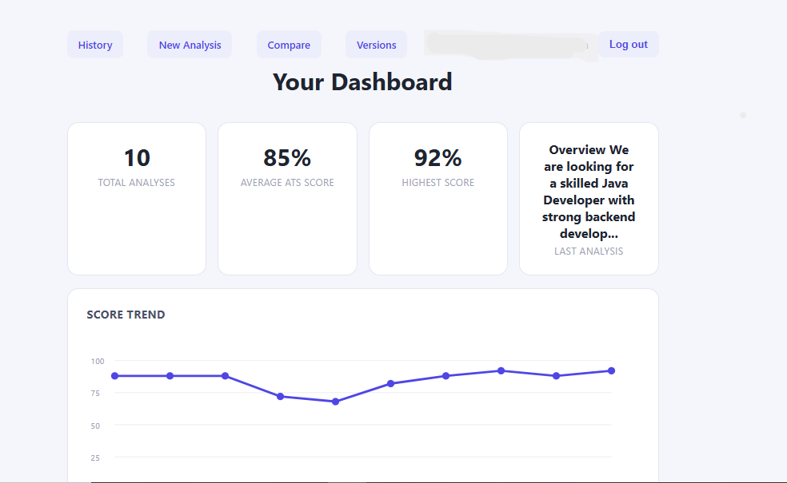
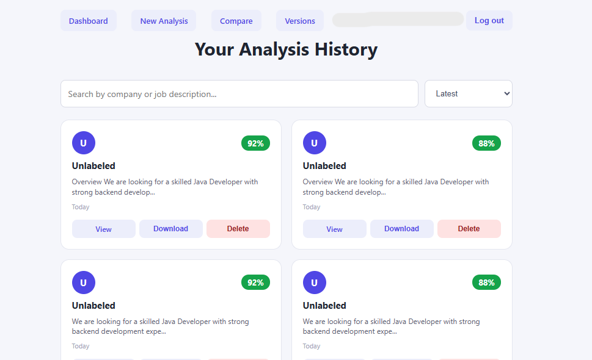
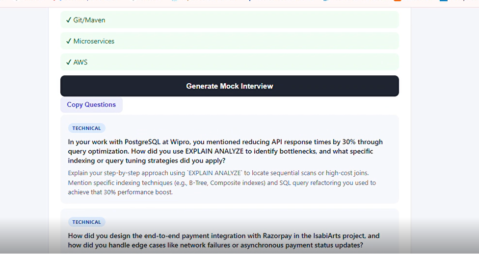

# ResumeIQ AI

## AI-Powered Resume & Career SaaS — Java 17 + Spring Boot 3

ResumeIQ AI is a complete source-code project for developers who want to build and customize their own AI-powered resume and career platform.

It combines resume analysis, AI-powered rewriting, resume comparison, versioning, and interview preparation in one application.

> **This repository is a public showcase/documentation page. The complete source code is available separately.**

---

## 🚀 Features

- ATS-style Resume Analysis
- Match & ATS Scoring
- Missing Keywords Detection
- Missing Skills Identification
- Keyword Density Analysis
- Experience Gap Detection
- Resume Improvement Suggestions
- AI Resume Rewriting
- Resume Comparison
- Resume Versioning
- AI Interview Preparation
- Analysis History
- Dashboard & Score Trends
- Searchable Analysis History
- FREE / PRO Usage-Limit Infrastructure
- Pluggable AI Provider Architecture

---
## 📸 Screenshots

### Dashboard

### Analysis History

### AI Interview Preparation

---
## 🛠️ Tech Stack

- Java 17
- Spring Boot 3
- Spring Security
- Spring Data JPA
- Thymeleaf
- MySQL
- OpenAI API
- Maven

---

## 🤖 AI Provider Architecture

The AI layer follows a pluggable architecture that can support multiple providers, including:

- OpenAI
- Google Gemini
- Ollama

This allows developers to adapt the AI integration according to their project requirements.

---

## 📊 What You Get

The source-code package includes:

- Complete application source code
- Database script
- API documentation
- Architecture diagram
- Installation guide
- Postman collection
- README & user documentation
- Sample resume
- Sample job description

---

## 👨‍💻 Who Is This For?

ResumeIQ AI is designed for:

- Java / Spring Boot developers
- SaaS founders
- Freelancers & agencies
- Developers building AI-powered career platforms
- Students learning AI + Spring Boot application development

---

## 💡 Why ResumeIQ AI?

Instead of starting an AI-powered career platform from scratch, developers can use the project as a foundation, understand the architecture, customize the features, and build their own application on top of it.

---

## 🛒 Get the Complete Source Code

The complete source-code package is available on Gumroad.

### Regular License — ₹1,999

Build and deploy one end product.

### Extended License — ₹5,999

Use the source code across unlimited client projects and deployments, including your own SaaS.

Source-code redistribution or resale is not permitted under either license.

👉 **Get ResumeIQ AI on Gumroad:**

https://javacoder716.gumroad.com/l/resumeiq-ai

---

## 📌 Important Note

Payment gateway integration such as Stripe or Razorpay checkout and subscription lifecycle is intentionally not included.

The project includes the foundations for user plans, usage limits, and premium access so developers can integrate their preferred billing provider.

---

## 🏗️ Built By

**IsabiTech**

Java • Spring Boot • AI • SaaS

Building developer-focused software products and reusable engineering solutions.
